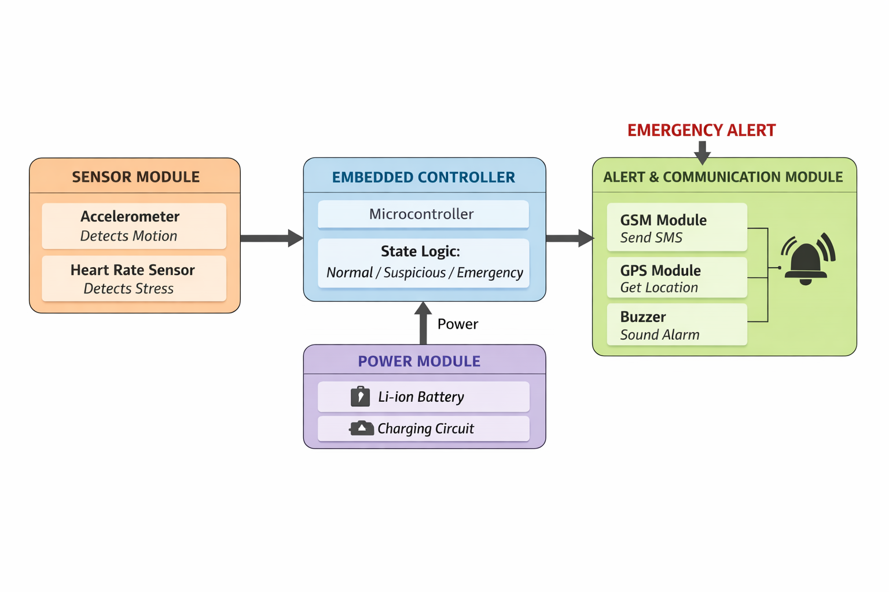

# Women's Safety System

Real-time wearable safety device that sends an SOS alert with live location to guardians.

## System Block Diagram

## Features
- Panic/touch button for manual SOS
- Motion/tilt sensing for fall detection
- Heart rate sensor to detect stress
- GPS location sent via SMS to guardians
- Buzzer alarm

## Tech Used
Microcontroller, GPS module, GSM module, heart rate sensor, buzzer, Li-ion battery

## How it works
1. Sensors monitor motion, heart rate, and panic button
2. Microcontroller checks the readings
3. On emergency, GPS location is fetched
4. SMS with location is sent to guardians and buzzer sounds
